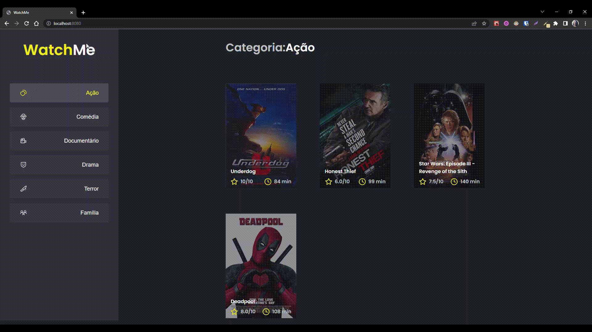

# 📚 Desafio complementar - Componentizando a aplicação

> Esse é o desafio complementar proposto no chapter I da trilha de React, cujo objetivo é treinar a componentização da aplicação React.
>
> _Status: concluído._



## ✅ Objetivos

- [x] Criar componente separado para a sidebar
- [x] Criar componente separado para a seção de conteúdo

## 🚀 Tecnologias utilizadas

- ReactJS
- TypeScript
- Axios
- Json server
- Sass

## 💻 Como rodar

1. Clonar o repositório:

```bash
git clone git@github.com:lineavelino/ignite-desafio1-2.git
```

2. Entrar na pasta do repositório:

```bash
cd ignite-desafio1-2
```

3. Abrir no editor (manualmente ou pela linha de código, como no exemplo):

```bash
code .
```

4. Instalar as dependências:

```bash
yarn
```

5. Rodar o servidor (porta 3333):

```bash
yarn server
```

6. Rodar a aplicação (porta 8080):

```bash
yarn dev
```
